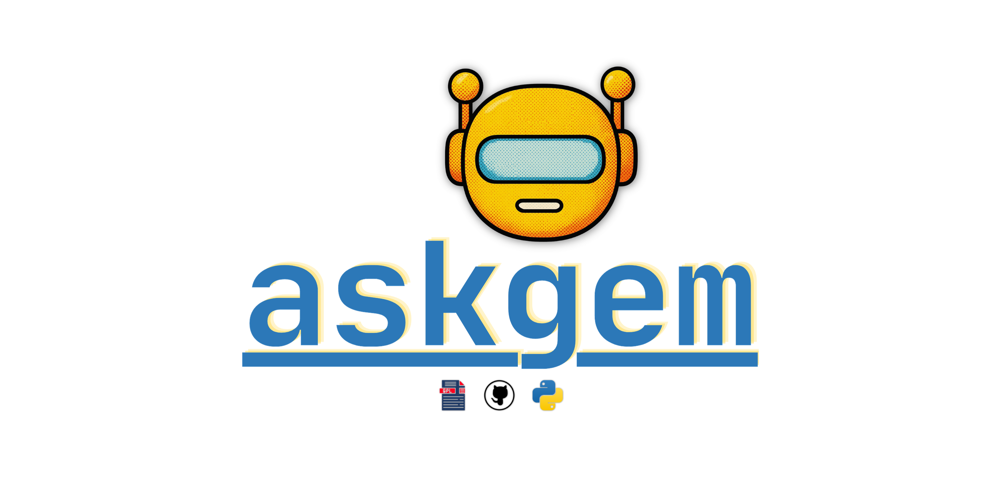
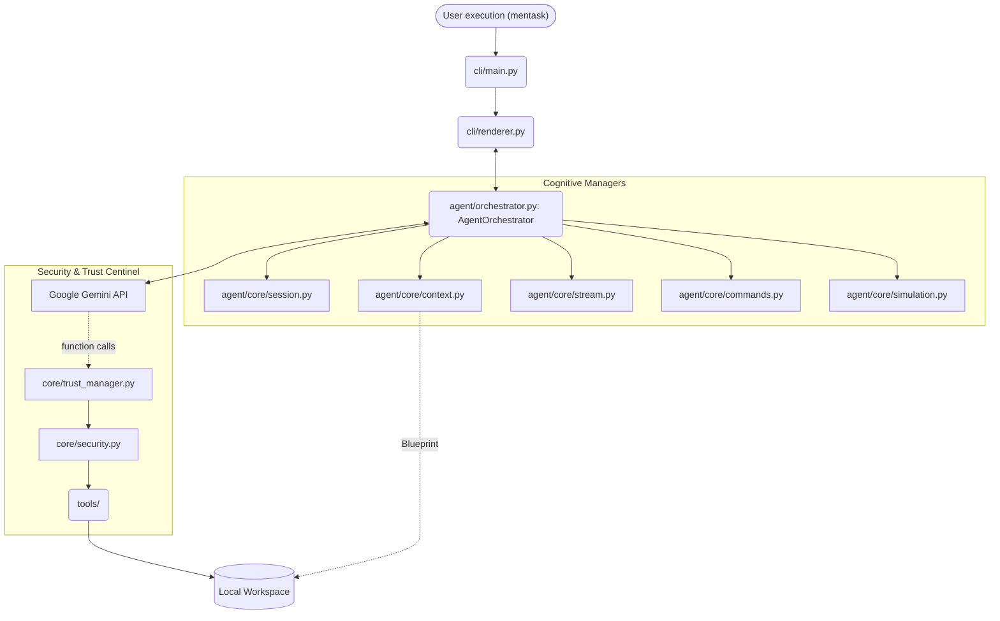

# mentask — Autonomous AI Coding Agent for the Terminal

[](https://www.python.org/downloads/) [](LICENSE) [](https://models.dev/) [](https://github.com/astral-sh/ruff) [](https://github.com/julesklord/mentask/actions/workflows/security.yml) [](https://github.com/julesklord/mentask/actions/workflows/release.yml)

---



---

**WORK IN PROGRESS** | *Formerly known as askgem*

---

**mentask** is a professional, autonomous coding agent that lives in your terminal.
Powered by [models.dev](https://models.dev/) and Google Gemini, it reads your files, edits your code, runs shell commands,
and navigates your filesystem — all within an interactive session and with
hardened safety guardrails that keep you in control.

No GUI. No cloud sync. No bloat. Just a fast, opinionated CLI agent you can trust
with your codebase.

---

## Contents

- [How it works](#how-it-works)
- [Features](#features)
- [New in v0.18.5: Lisan al-Gaib](#new-in-v0185-lisan-al-gaib)
- [Project Isolation (/init)](#project-isolation-init)
- [Installation](#installation)
- [Configuration](#configuration)
- [Usage](#usage)
- [Slash commands](#slash-commands)
- [Safety model](#safety-model)
- [Architecture](#architecture)
- [Development & Simulation](#development--simulation)
- [Internationalization](#internationalization)
- [Repository Standard](#repository-standard)
- [Roadmap](#roadmap)
- [Contributing](#contributing)
- [License](#license)

---

## How it works

mentask runs an advanced asynchronous reasoning loop powered by the **AgentOrchestrator** and a modular manager-based core. On each turn:

1. **Environmental Awareness**: At startup, the **ContextManager** performs a **Project Blueprint** scan, discovering the project type, structure, and key files to build a proactive system instruction.
2. **Cognitive Loop**: Your message is processed by the **AgentOrchestrator**, which manages the *Thinking -> Action -> Observation* cycle.
3. **Tool Reasoning**: The model calls specialized tools (read, edit, execute). mentask intercepts these via the **ToolDispatcher**.
4. **Safety Guard**: Every action passes through the **Security Layer** for real-time risk analysis and path validation.
5. **Stream Processing**: The **StreamProcessor** extracts function calls and text mid-flight, showing you the agent's "thought process" in real-time.
6. **Persistence**: The full session, including tool results and metrics, is auto-saved to your Workspace history.

This autonomous loop repeats until the mission is accomplished or you interrupt it.

---

## Features

### Agentic tool engine

| Tool | Description |
|---|---|
| `list_directory` | Explore filesystem trees with depth control |
| `read_file` | Read any file with optional line ranges — 30k char cap prevents token overflow |
| `edit_file` | Find-and-replace with **atomic writing**, uniqueness guard, and automatic `.bkp` backup |
| `execute_bash` | Run shell commands with 60s timeout and full **Risk Analysis** |
| `manage_memory` | Save important project facts to `memory.md` for long-term recall |
| `manage_mission` | Track complex goals and sub-tasks via `heartbeat.md` mission control |
| `manage_workspace` | Detects and initializes local project knowledge bases |

### Workspace Isolation & Local Intelligence

mentask now distinguishes between your **Global Persona** and your **Project Context**:

- **Local Isolation**: Run `/init` to create a dedicated `.mentask/` folder in your project. This isolates sessions, settings, and identity to the current directory.
- **Local Priority**: If a `.mentask/` folder exists, it takes precedence for settings, memory, and history.
- **Project Memory**: Knowledge saved via `manage_memory` is stored in `.mentask/memory.md` (or `.mentask_knowledge.md` as fallback), preventing context leakage between repositories.
- **Project Identity**: Customize mentask's personality for a specific project via `.mentask/identity.md`.

### Human-in-the-loop safety

Every destructive action is categorized by risk level (`SAFE`, `NOTICE`, `WARNING`, `DANGEROUS`).
Switch modes anytime mid-session:

- **`/mode manual`** (default) — approve each file edit and shell command.
- **`/mode auto`** — trust the agent fully; all actions execute without prompts.

### Streaming terminal UX

mentask now runs through a Rich-based terminal renderer:

- Real-time Markdown streaming in the terminal.
- Inline confirmations for file edits and shell commands.
- Focus on a fast, scriptable CLI flow instead of a separate dashboard app.

### Persistent session history

Every conversation auto-saves to `~/.mentask/history/` as JSON. Reload any past
session with `/history load <id>`. A rolling context window and proactive summarization
keep reloaded sessions within token budget.

---

## New in v0.18.5: Lisan al-Gaib

The v0.18.5 release ("Lisan al-Gaib") transforms mentask into a persistent, self-correcting agent with advanced cognitive tools.

### 1. Persistent Gem-Style Renderer

A complete architectural overhaul of the CLI output. All thoughts, tool calls, and results now persist in your terminal scroll buffer, providing a seamless and professional experience similar to Google's own Gem CLI.

### 2. Intelligence Tools (Working Memory & Planning)

- **`working_memory`**: A semantic scratchpad for the agent to store hypotheses and partial conclusions across multiple turns.
- **`plan`**: Interactive checkpointing of `.mentask_plan.md` to track multi-step missions effectively.

### 3. Self-Critique & Error Correction

Integrated reflection loops that force the agent to analyze tool failures before attempting alternative strategies, significantly increasing operational success rates.

### 4. Advanced UX Commands

- **`/undo`**: Instantly rollback accidental file modifications.
- **`/artifacts`**: Browse and expand previous tool results with a compact, interactive UI.
- **`/theme`**: Switch between premium color schemes (indigo, monokai, ocean) in real-time.

### 5. Robust Security & Memory

Automatic file backups and dynamic context management to prevent token overflows and memory leaks in long sessions.

---

## Installation

### Prerequisites

- **Python 3.10+**.
- A **Google API Key** — free at [Google AI Studio](https://aistudio.google.dev/).

### From source (recommended)

```bash
git clone https://github.com/julesklord/mentask
cd mentask.py
python -m venv venv
# On Windows: venv\Scripts\activate
source venv/bin/activate
pip install -e ".[dev]"
```

---

## Configuration

### API key (Standardized)

mentask loads your key from these sources, in order:

1. **Environment variable** — `GEMINI_API_KEY=your_key mentask` (Preferred)
2. **System Keyring** — Secure storage via Windows Credential Manager or macOS Keychain (Recommended).
3. **Saved file** — `~/.mentask/settings.json` (Local fallback).

On first launch without a key, mentask prompts interactively and saves it securely in your system's keyring.

### Settings file

You can find the global configuration at `~/.mentask/settings.json`.

---

## 🧠 Core Knowledge Hub

mentask now features a **Hierarchical Knowledge Hub**, separating core behavioral rules from user-specific customizations. The agent reloads its intelligence every turn from three layers:

1. **📦 Standard Hub (Internal)**: Built-in modules defining the "Staff Engineer" persona, operational safety rules, and multimodal guidelines (audio/video/vision).
2. **🌍 Global Hub (`~/.mentask/*.md`)**: Your cross-project technical preferences, API guidelines, or personal style.
3. **🚀 Project Hub (`.mentask/*.md`)**: Project-specific context, build commands, architecture rules, and "Mission" specifics.

> [!TIP]
> Just drop a `.md` file in any of these locations to instantly update mentask's cognitive behavior without touching the code.

## 👁️ Multimodal Intelligence

Fully optimized for Gemini 1.5 Pro and 2.0 Flash:

- **Screenshots**: Analyze UI layouts and design systems.
- **Video**: Summarize technical demos and terminal recordings.
- **Audio**: Digest project discussions and voice notes.

---

## Usage

Stored at `~/.mentask/settings.json` (POSIX) or `%APPDATA%\mentask\settings.json` (Windows):

```json
{
    "model_name": "gemini-1.5-flash",
    "edit_mode": "manual"
}
```

### Configuration paths

| Path | Purpose |
|---|---|
| `~/.mentask/settings.json` | Model name, edit mode, and user preferences |
| `~/.mentask/history/` | Auto-saved session JSON files |
| `~/.mentask/mentask.log` | Debug log — tool execution events and retry details |

---

## Usage

Launch the agent:

```bash
mentask
```

### Common Workflows

- **Context Analysis:** "Read my `pyproject.toml` and explain the dependencies."
- **Code Generation:** "Create a `src/utils.py` file with a function to calculate SHA256 hashes."
- **Refactoring:** "Refactor `authenticate()` in `src/auth.py` to use JWT instead of sessions."
- **Exploration:** "Find all TODO comments in the project and group them by file."

### Exiting

Type `exit`, `quit`, `q`, or press `Ctrl+C`.

---

## Slash commands

| Command | Description |
|---|---|
| `/help` | Show the full command reference and examples |
| `/model <name>` | Switch Gemini models mid-conversation (history preserved) |
| `/mode [auto/manual]` | Toggle between approving actions or automatic execution |
| `/clear` | Reset the context window to free up tokens without ending session |
| `/usage` | Show detailed token consumption and estimated USD cost |
| `/stats` | Summary of session accomplishments (messages, tools, files) |
| `/stop` | Interrupt the current generation immediately |
| `/reset` | Restart the entire session and reset all counters |
| `/init` | Initialize local project isolation and configuration |
| `/history [list/load/delete]` | Manage saved conversation sessions |
| `/trust [path]` | Add a directory to the permanent whitelist |
| `/untrust [path]` | Remove a directory from the whitelist |

---

## Safety model

**Always, regardless of mode (Sandboxed Environment):**

- **Trust Management Layer:** mentask now implements a strict whitelist for file operations. By default, it can only touch the current workspace. Use `/trust` to authorize external paths.
- **Cross-Drive Protection:** On Windows, the agent is blocked from crossing drive letters (e.g., C: to G:) unless the target is explicitly trusted, preventing unintended system-wide access.
- **Risk Analysis Engine:** Powered by `core/security.py`, every command is categorized:
  - `SAFE`: Informative commands (ls, git status).
  - `NOTICE`: Standard operations.
  - `WARNING`: High-risk patterns (sudo, sensitive file access).
  - `DANGEROUS`: Critical risk (rm -rf, fork bombs, world-writable chmod).
- **Atomic Writing:** `edit_file` uses a temporary file + rename strategy to prevent corruption.
- **Automatic Backups:** Every file modification creates a `.bkp` backup at `<path>.bkp`.
- **Hard Timeouts:** Shell commands have a strict 60-second execution limit.

---

## Architecture

mentask operates across three tightly decoupled layers enforcing strong logical boundaries. As of version **0.16.0**, the system has evolved into an **Orchestrated Architecture**, where a central engine manages cognitive managers, security centinels, and an autonomous LSP verification loop.

### High-Level System Diagram



### Layer Breakdown

1. **Presentation Layer (`cli/`)**: Handles CLI startup, interactive prompts, audit views, and real-time Markdown rendering.
2. **Cognitive Layer (`agent/`)**: The "Brain". Powered by the `AgentOrchestrator`, it manages state, context blueprints, and mission tracking.
3. **Security Layer (`core/`)**: The "Guard". Gathers risk analysis and whitelisting logic to ensure the agent never exceeds its authority.

### Project Structure (v0.16.4)

```
mentask.py/
├── src/mentask/
│   ├── __init__.py              # Single source of truth for version (0.18.5)
│   ├── agent/
│   │   ├── orchestrator.py      # The Reasoning Brain — Thinking/Action/Observation
│   │   ├── schema.py            # Unified message and tool schemas
│   │   └── core/                # Cognitive Managers
│   │       ├── session.py       # API lifecycle, Retries and Error handling
│   │       ├── context.py       # Blueprint, Memory and Mission management
│   │       ├── commands.py      # Slash command handler
│   │       └── simulation.py    # Deterministic loop recording
│   ├── cli/
│   │   ├── main.py              # Entry point and session initialization
│   │   ├── renderer.py          # Rich streaming renderer and interactive prompts
│   ├── core/
│   │   ├── security.py          # Hardened safety engine
│   │   ├── trust_manager.py     # Directory trust whitelist control
│   │   ├── paths.py             # OS-agnostic path resolution (Workspace aware)
│   ├── tools/                   # Atomic agentic tools
│   └── locales/                 # i18n JSON data (8 languages supported)
├── tests/                       # Reliable unit and integration tests
├── scripts/                     # Maintenance and diagnostic utilities
├── docs/                        # Rich documentation and assets
└── pyproject.toml
```

---

## Development & Simulation

### Setup

```bash
git clone https://github.com/julesklord/mentask
cd mentask.py
pip install -e ".[dev]"
```

### Reliable Testing Protocol

mentask introduces a **Simulation Layer**. You can record agent turns and play them back deterministically:

1. **Record:** Set `SIMULATION_MODE=record` to capture interactions.
2. **Playback:** Run `pytest tests/integration/test_full_agent_loop.py` to verify the logic against the recorded transcript without hitting the real API.

### Tests & Linting

```bash
pytest tests/                   # full reliable suite
ruff check src/ tests/ --fix    # auto-fix linting violations
```

---

## Internationalization

mentask is **English-First** at the SDK/System level for maximum model reliability, but the entire user interface supports 8 languages:

| Code | Language | File |
|---|---|---|
| `en` | English (Standard) | `en.json` |
| `es` | Español | `es.json` |
| `fr` | Français | `fr.json` |
| `pt` | Português | `pt.json` |
| `de` | Deutsch | `de.json` |
| `it` | Italiano | `it.json` |
| `ja` | 日本語 | `ja.json` |
| `zh` | 中文 (简体) | `zh.json` |

---

## Repository Standard

`mentask.py` is now the reference repo for structure, hygiene, and architecture conventions in this workspace.

See [STANDARD.md](STANDARD.md) for the operating standard to apply across the other repositories.

---

## Roadmap

| Version | Theme | Status |
|---|---|---|
| `v0.14.0`| Stability, Renderer Polish | ✅ Done |
| `v0.15.0`| **Kwisatz Haderach** - LSP Integration | ✅ Done |
| `v0.16.0`| **The Golden Path** - Professional Recovery | ✅ Done |
| `v0.18.0`| **Lisan al-Gaib** - Cognitive Architecture | ✅ Done |
| `v0.18.5`| **Full Branding & Stability** | ✅ Done |
| `v0.19.0`| **Water of Life** - Self-Healing Loop | 📋 Planned |
| `v0.20.0`| **God Emperor** - Absolute Orchestration | 📋 Planned |

---

## License

GNU General Public License v3.0 — see [LICENSE](LICENSE) for full terms.

Built by [julesklord](https://github.com/julesklord).
