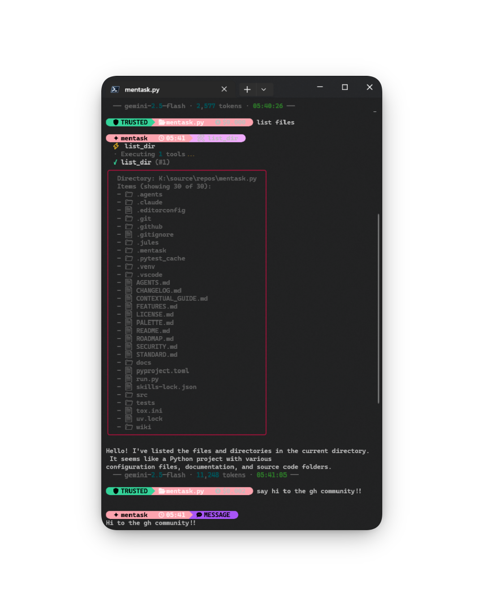

# README

<table data-header-hidden><thead><tr><th align="center" valign="top"></th><th valign="top"></th></tr></thead><tbody><tr><td align="center" valign="top"></td><td valign="top"><h2>mentask</h2><p><strong>Autonomous agent for CLI-based engineering</strong><br></p><p><a href="https://pypi.org/project/mentask/"></a> <a href="https://www.python.org/downloads/"></a> <a href="https://github.com/TropicalDevApps/mentask.py/blob/main/LICENSE/README.md"></a> <a href="https://models.dev/"></a> <a href="https://github.com/astral-sh/ruff"></a></p></td></tr></tbody></table>

***

### Installation & Setup

mentask runs locally with a minimal footprint.

#### Prerequisites

* **Python:** 3.10+
* **API Key:** Google Gemini, OpenAI, or DeepSeek
* **System:** `bash` (UNIX) or `pwsh` (Windows)
* **RAM:** 4GB minimum

***

<div align="center"></div>

***

#### Setup

Clone and install in a virtual environment:

```zsh
git clone https://github.com/TropicalDevApps/mentask
cd mentask

python -m venv .venv
source .venv/bin/activate  # On Windows: .venv\Scripts\activate

pip install -e ".[dev]"
```

**Local Mode:** Use [Ollama](https://ollama.com) for offline execution:

```zsh
ollama pull qwen3.5
mentask --local
```

#### First Run

Launch mentask in your project directory:

```zsh
mentask
```

mentask stores API keys in your OS's native secret service via `keyring`. Keys remain encrypted on disk.

**Environment Variable Configuration:**

```zsh
export GEMINI_API_KEY="your-key-here"
export OPENAI_API_KEY="your-key-here"
export DEEPSEEK_API_KEY="your-key-here"
mentask
```

***

### Capabilities

mentask executes the full engineering loop autonomously. It manages state and orchestrates tools:

* **File Management:** Parses AST and understands code scope.
* **Code Modification:** Injects fixes without breaking syntax.
* **Linter Integration:** Intercepts diagnostics in real-time.
* **Test Execution:** Captures tracebacks and iterates on failures.
* **Self-Correction:** Fixes mistakes before completing tasks.

The agent synthesizes new Python modules to solve repetitive problems. It validates the AST, loads modules into memory, and uses them immediately.

***

#### Dynamic Engineering Levels (DEL)

The Task Classifier pre-flights prompts to set engineering rigor:

* **L0\_INQUIRY**: Direct answers without tool use.
* **L1\_PRAGMATIC**: Fast execution using raw shell commands.
* **L2\_STANDARD**: Research-led development loop.
* **L3\_ARCHITECT**: Formal planning and system mapping.

#### Stall Detection

The orchestrator detects thinking loops. It triggers a Strategy Reset to force a different execution path when the agent fails to act.

***

#### Autonomous Forge Engine

When tasks require custom logic, mentask invokes the Forge:

1. **Synthesis**: Generates a Python module subclassing `BaseTool`.
2. **Validation**: Runs `ast.parse()` to guarantee syntax and dependency compatibility.
3. **Security**: Loads dynamic plugins only from trusted workspaces.
4. **Injection**: Compiles bytecode and injects modules into the ToolRegistry.
5. **Execution**: Invokes the new tool in the next turn.

***

### Architecture

The orchestration engine uses three independent layers.


```mermaid
flowchart TD

subgraph group_entry["Entry"]
  node_run_py(("run.py<br/>entrypoint<br/>[run.py]"))
end

subgraph group_ui["CLI/UI"]
  node_cli_main["CLI main<br/>cli bootstrap<br/>[main.py]"]
  node_cli_renderer["Renderer<br/>ui render<br/>[gem_renderer.py]"]
  node_cli_console["Console<br/>ui shell<br/>[console.py]"]
  node_tui_layout["Layout<br/>[layout.py]"]
  node_ui_interface["UI iface<br/>adapter<br/>[ui_interface.py]"]
end

subgraph group_agent["Agent"]
  node_orchestrator["Orchestrator<br/>agent loop<br/>[orchestrator.py]"]
  node_chat["Chat<br/>prompt flow<br/>[chat.py]"]
  node_schema["Schema<br/>[schema.py]"]
  node_commands["Commands<br/>[commands.py]"]
  node_session[("Session<br/>runtime state<br/>[session.py]")]
  node_context["Context<br/>[context.py]"]
  node_execution["Execution<br/>[execution.py]"]
  node_provider["Provider<br/>model gateway<br/>[provider.py]"]
  node_providers["LLM adapters<br/>model impls"]
  node_tools_registry["Tool registry<br/>tool dispatch<br/>[tools_registry.py]"]
  node_agent_tools["Agent tools<br/>tool contracts"]
end

subgraph group_core["Core State"]
  node_plugin_loader["Plugin loader<br/>extensibility<br/>[plugin_loader.py]"]
  node_mcp_manager["MCP manager<br/>integration hub<br/>[mcp_manager.py]"]
  node_security["Security<br/>policy<br/>[security.py]"]
  node_trust["Trust<br/>policy<br/>[trust_manager.py]"]
  node_paths["Paths<br/>state location<br/>[paths.py]"]
  node_config["Config<br/>[config_manager.py]"]
  node_history["History<br/>persistence<br/>[history_manager.py]"]
  node_memory["Memory<br/>persistence<br/>[memory_manager.py]"]
  node_tasks["Tasks<br/>workspace state<br/>[tasks_manager.py]"]
end

subgraph group_tools["Tools"]
  node_shell_tools["Shell tools<br/>local action<br/>[system_tools.py]"]
  node_file_tools["File tools<br/>ast ops<br/>[file_tools.py]"]
  node_search_tools["Search tools<br/>semantic<br/>[search_tools.py]"]
  node_web_tools["Web tools<br/>fetch/parse<br/>[web_tools.py]"]
  node_memory_tools["Memory tools<br/>embedding<br/>[memory_tools.py]"]
  node_analysis_tools["Analysis tools<br/>logic<br/>[analysis_logic.py]"]
end

node_run_py -->|"starts"| node_cli_main
node_cli_main -->|"renders"| node_cli_renderer
node_cli_main -->|"buffers"| node_cli_console
node_cli_renderer -->|"layout"| node_tui_layout
node_cli_main -->|"sends"| node_ui_interface
node_ui_interface -->|"notifies"| node_orchestrator
node_orchestrator -->|"reads/writes"| node_session
node_orchestrator -->|"manages"| node_context
node_orchestrator -->|"dispatches"| node_execution
node_orchestrator -->|"prompts"| node_chat
node_chat -->|"writes"| node_history
node_orchestrator -->|"queries"| node_provider
node_provider -->|"delegates"| node_providers
node_orchestrator -->|"invokes"| node_tools_registry
node_tools_registry -->|"maps"| node_agent_tools
node_tools_registry -->|"extends"| node_plugin_loader
node_tools_registry -->|"bridges"| node_mcp_manager
node_agent_tools -->|"uses"| node_shell_tools
node_agent_tools -->|"uses"| node_file_tools
node_agent_tools -->|"uses"| node_search_tools
node_agent_tools -->|"uses"| node_web_tools
node_agent_tools -->|"uses"| node_memory_tools
node_agent_tools -->|"uses"| node_analysis_tools
node_file_tools -->|"guards"| node_security
node_shell_tools -->|"checks"| node_trust
node_file_tools -->|"resolves"| node_paths
node_config -->|"stores"| node_paths
node_history -->|"persists"| node_paths
node_memory -->|"persists"| node_paths
node_tasks -->|"persists"| node_paths
node_orchestrator -->|"enforces"| node_security
node_orchestrator -->|"enforces"| node_trust

classDef toneNeutral fill:#f8fafc,stroke:#334155,stroke-width:1.5px,color:#0f172a
classDef toneBlue fill:#dbeafe,stroke:#2563eb,stroke-width:1.5px,color:#172554
classDef toneAmber fill:#fef3c7,stroke:#d97706,stroke-width:1.5px,color:#78350f
classDef toneMint fill:#dcfce7,stroke:#16a34a,stroke-width:1.5px,color:#14532d
classDef toneRose fill:#ffe4e6,stroke:#e11d48,stroke-width:1.5px,color:#881337
classDef toneIndigo fill:#e0e7ff,stroke:#4f46e5,stroke-width:1.5px,color:#312e81
classDef toneTeal fill:#ccfbf1,stroke:#0f766e,stroke-width:1.5px,color:#134e4a
class node_run_py toneBlue
class node_cli_main,node_cli_renderer,node_cli_console,node_tui_layout,node_ui_interface toneAmber
class node_orchestrator,node_chat,node_schema,node_commands,node_session,node_context,node_execution,node_provider,node_providers,node_tools_registry,node_agent_tools toneMint
class node_plugin_loader,node_mcp_manager,node_security,node_trust,node_paths,node_config,node_history,node_memory,node_tasks toneRose
class node_shell_tools,node_file_tools,node_search_tools,node_web_tools,node_memory_tools,node_analysis_tools toneIndigo
```

#### Module Breakdown

| Component            | Responsibility                                                            |
| -------------------- | ------------------------------------------------------------------------- |
| **Orchestrator**     | Central Think→Act→Observe loop using ReAct prompting.                     |
| **Context Snapping** | Summarizes history when token usage hits 80% to prevent buffer explosion. |
| **Plugin Loader**    | Injects agent-forged tools into the registry.                             |
| **Trust Manager**    | Validates paths and authorizations to block unauthorized access.          |
| **Ruff Integration** | Intercepts diagnostics to trigger autonomous correction.                  |
| **History Manager**  | Persists execution traces in SQLite.                                      |
| **Memory Manager**   | Indexes past operations via embeddings for context retrieval.             |

***

### Workflows

#### Multi-File Refactoring

Give mentask a task across multiple files:

```zsh
> refactor error handling in src/services/*.ts to use ErrorBoundary
```

mentask scans files, detects patterns, and applies changes. It validates syntax with Ruff and executes tests autonomously.

#### Semantic Code Search

Search for logical patterns across the codebase. mentask indexes the project with embeddings to find similar code blocks and validates them against Pydantic schemas.

#### Plugin Development

Ask mentask to create its own tools:

```zsh
> create a tool that converts audio files in batch using ffmpeg
```

The agent generates the tool, validates the AST, and loads it for immediate use.

***

### Security

Security and isolation protect your system:

* **Whitelisting**: mentask only interacts with directories you authorize via `/trust`.
* **Plugin Isolation**: Auto-loading requires explicit workspace trust.
* **Path Resolution**: Resolves symlinks to prevent traversal attacks.
* **Atomic Operations**: Uses temporary files and snapshots for mutations.
* **Keyring Integration**: Stores API keys in the OS secure enclave.

***

### Commands

| Command         | Purpose                              |
| --------------- | ------------------------------------ |
| `/help`         | Show commands and settings.          |
| `/init`         | Bootstrap a mentask project.         |
| `/model <id>`   | Swap models during a session.        |
| \`/mode \[auto  | manual]\`                            |
| `/trust [path]` | Authorize a directory.               |
| `/undo`         | Rollback the last file modification. |
| `/stats`        | View token usage and costs.          |

***

### Dependencies

mentask maintains a minimal dependency tree:

* `google-genai`: Gemini API protocol.
* `rich`: Console formatting and TUI.
* `keyring`: Secure key storage.
* `pydantic`: Schema validation.

Total dependency tree: \~35 packages.

***

### FAQ

#### Is mentask safe for production?

File modifications are atomic and undoable. Review changes in `/manual` mode for sensitive code.

#### Can mentask access files outside the project?

Only if you authorize the path via `/trust`.

#### How do I update API keys?

Use `keyring set mentask gemini_api_key` or export a new environment variable.

#### Does it work offline?

Local execution requires Ollama and a supported model.

***

### Contributing

Fork the repository and submit a pull request. Ruff enforces code style.

```bash
pip install -e ".[dev]"
pytest tests/
ruff format src/
```

***

### License

Released under the **MIT License**. Developed by [TropicalDev](https://github.com/TropicalDevApps).
