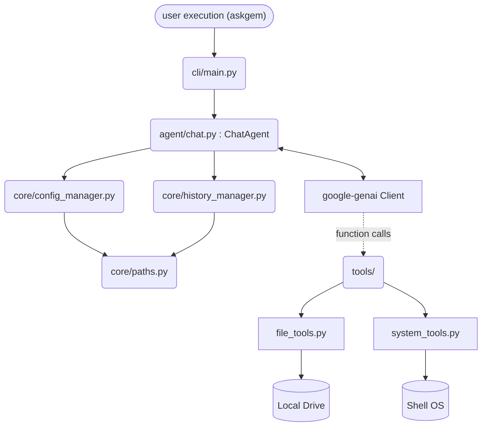

# Architecture

The system operates across three tightly decoupled layers enforcing strong logical boundaries.

## High-Level System Diagram

## Module Breakdown

1. **`src/askgem/cli/` (Presentation Layer)**
    * `main.py`: Bootstraps the application, loads the agent, and powers the interactive initialization strings.
    * `console.py`: Re-usable Rich console formatter singleton.

2. **`src/askgem/agent/` (Cognitive Layer)**
    * `chat.py`: Holds the main `ChatAgent` representing the interactive loop and SDK function parsing. It routes prompt cycles.

3. **`src/askgem/core/` (State Management Layer)**
    * `paths.py`: Root level mapping resolving circular imports for disk storage endpoints (`~/.askgem`).
    * `config_manager.py`: Extracts and persists API keys and configurations (`settings.json`).
    * `history_manager.py`: Caches, truncates, and serializes contexts per chat session.
    * `i18n.py`: Locale autodetection.

4. **`src/askgem/tools/` (Agentic Tools)**
    * Isolated stateless execution tools the model mounts dynamically (file edits, OS bash reads).

## Execution Flow

1. User enters `/home/julio/dev/askgem`.
2. `cli/main.py` starts, configuring Rich logging and building `ChatAgent`.
3. `ChatAgent` boots configs, initializes local file tool handlers, binds to the `gemini-2.5-pro` model, and injects OS-context system instructions.
4. User inputs prompt. `ChatAgent` invokes stream.
5. Model streams context chunks. Detected `function_calls` pause the stream payload to invoke `tools/file_tools.py` directly.
6. Results append to model loop context recursively.
7. Session finalizes, saved to disk by `core/history_manager.py`.

## Key Design Decisions

* **Decoupled Paths:** `core/paths.py` was separated explicitly to allow logging, history, and config components to query the host OS environment without engaging in circular imports.
* **Dual Function Detection:** `agent/chat.py` implements complex multi-fallback SDK parsing because upstream `google-genai` streaming behaviors differ dramatically between subversions.
