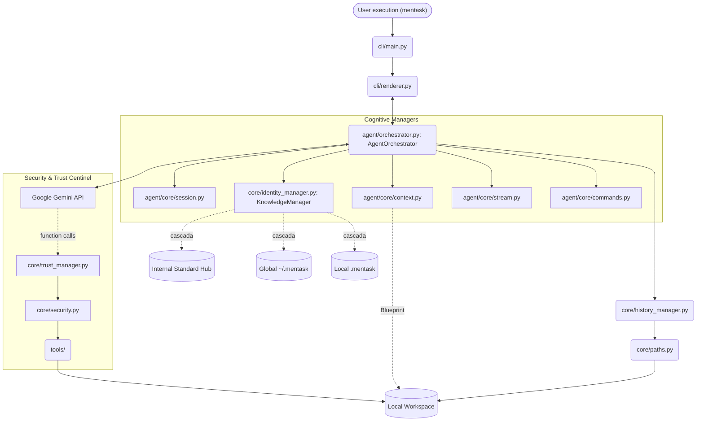

# Architecture

The system operate across three tightly decoupled layers enforcing strong logical boundaries. As of version **0.16.x**, the system has evolved into an **Orchestrated Hierarchical Architecture**, where a central engine manages cognitive managers, an optimized **On-Demand Knowledge Hub**, and security centinels.

## High-Level System Diagram

## Module Breakdown

1. **`src/mentask/cli/` (Presentation Layer)**
    * `main.py`: Entry point for session orchestration and environment boot.
    * `renderer.py`: Rich-based terminal renderer handling interactive prompts and streaming Markdown.

2. **`src/mentask/agent/` (Orchestration Layer)**
    * `orchestrator.py`: **[The Heart]** Central loop managing the *Thinking -> Action -> Observation* cycle. Supports simulation playback and tool routing.
    * **`agent/core/` (Cognitive Managers)**
        * `session.py`: Handles API lifecycle, exponential backoff, and simulation injection.
        * `context.py`: **[Blueprint Aware]** Performs project scans and assembles system prompts.
        * `stream.py`: Low-level tool extraction and metrics tracking.

3. **`src/mentask/core/` (State & Safety Layer)**
    * `identity_manager.py`: **[On-Demand Knowledge]** Orchestrates the hierarchical training system (Standard -> Global -> Project). In v0.16.x, this was optimized to use on-demand retrieval via tools instead of full-text injection.
    * `trust_manager.py`: Whitelist management for authorized directories.
    * `security.py`: Real-time risk analysis and path resolution guards.
    * `paths.py`: Maps package-internal folders, local `.mentask/` designs, and global configuration.
    * `metrics.py`: Token consumption and cost tracking.

## UI Note

The old Textual dashboard has been removed. `cli/dashboard.py` remains only as a compatibility stub that raises a clear deprecation error for stale imports.

## Execution Flow (v0.16.x Orchestrated)

1. **Environmental Boot**: `cli/main.py` detects if the CWD is a Workspace.
2. **On-Demand Knowledge**: `KnowledgeManager` prepares the Hub hierarchy, which the agent can now query dynamically via the `query_knowledge` tool to save tokens.
3. **Project Blueprint**: `ContextManager` performs a recursive scan of the project tree.
4. **Thinking Phase**: Gemini reasons using the aggregated Knowledge Hub and the injected project context.
5. **Action Request**: If a tool is requested, `TrustManager` and `SecurityCheck` verify the operation.
6. **Persistence**: History, Memory, and Session Metrics are saved within the hierarchical configuration paths.

## Key Design Decisions

* **Hierarchical Intelligence**: Behavioral logic and personality are modular markdown files. No rules are hardcoded in the engine.
* **Proactive Discovery**: The agent is instructed via the Standard Knowledge Hub to use `glob` and `grep` proactively to explore environments.
* **Multimodal Guidelines**: Dedicated standard modules guide the model on how to process images, video, and audio technical data.
